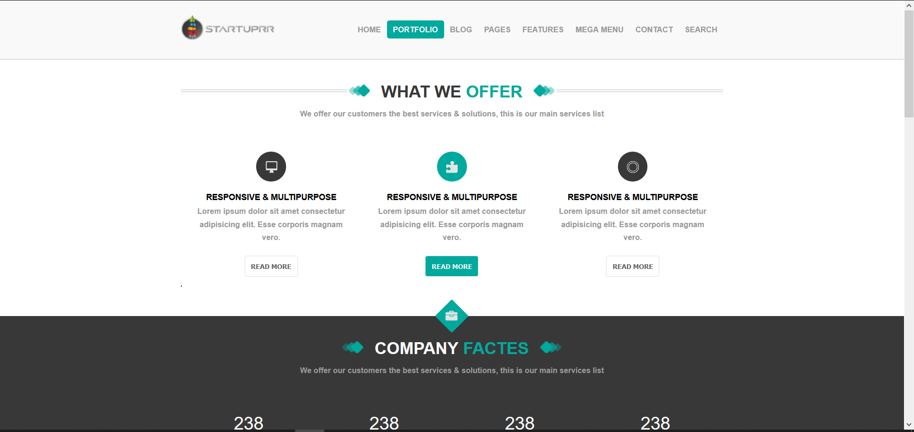
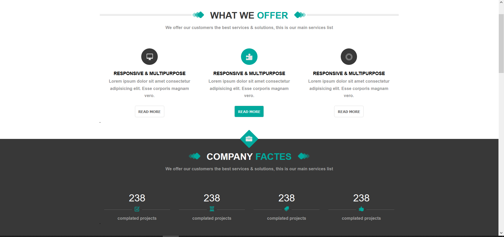
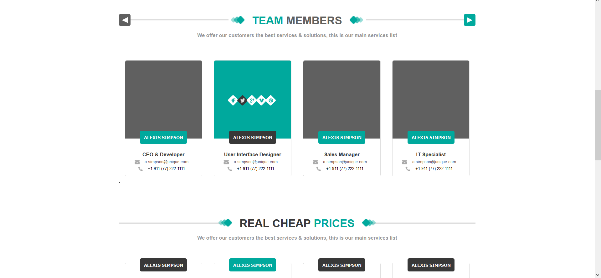
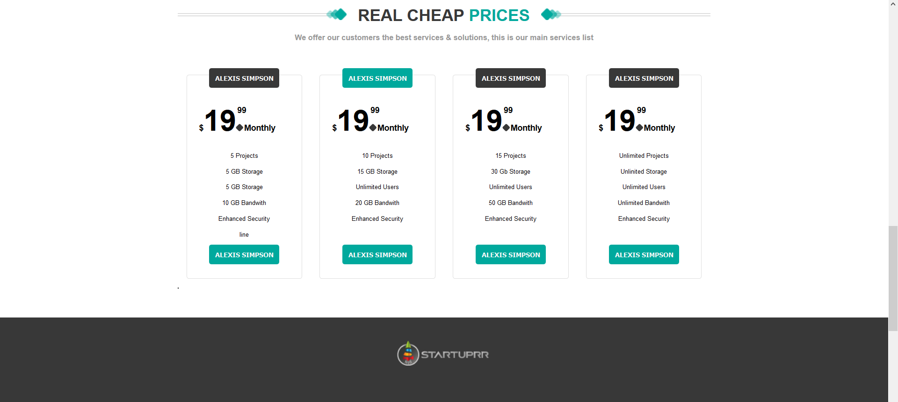
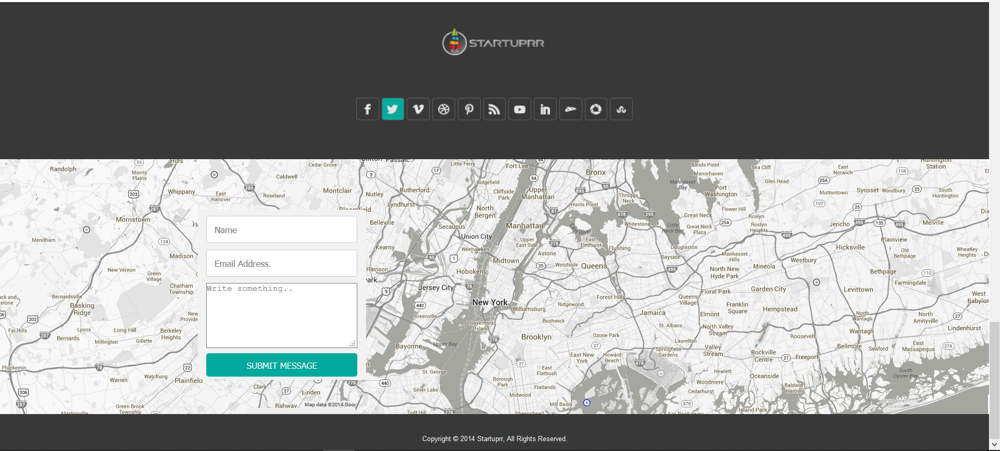

<!--
*** Thanks for checking out the Best-README-Template. If you have a suggestion
*** that would make this better, please fork the repo and create a pull request
*** or simply open an issue with the tag "enhancement".
*** Thanks again! Now go create something AMAZING! :D
-->

<!-- PROJECT SHIELDS -->
<!--
*** I'm using markdown "reference style" links for readability.
*** Reference links are enclosed in brackets [ ] instead of parentheses ( ).
*** See the bottom of this document for the declaration of the reference variables
*** for contributors-url, forks-url, etc. This is an optional, concise syntax you may use.
*** https://www.markdownguide.org/basic-syntax/#reference-style-links

<!-- PROJECT LOGO -->
 

  

  
<!-- ABOUT THE PROJECT -->
## About The Project
   
   
   
   
   
 
Template were cascaded by HTML5 & CSS3, also were used SASS(CSS pre-processor) , all this stuff are correctly in used in Static Mode.

### Built With

[SASS] 
[CSS3] 
[HTML5]

<!-- CONTACT -->
## Contact

Ashot Mouhsian  - amouhsian@gmail.com

Project Link: - https://github.com/ashot1990/myrepo.git

